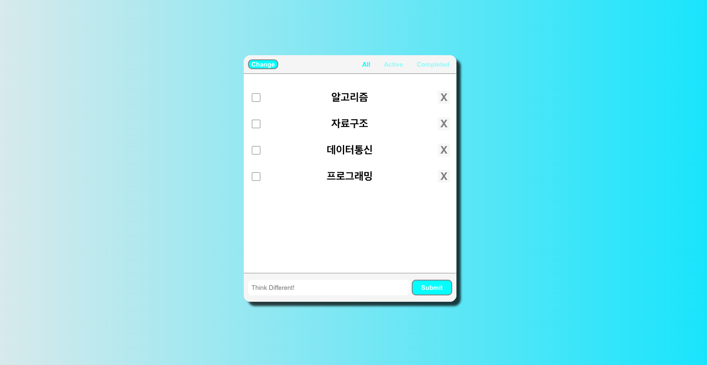

# todolist -- practice version

프로젝트 설명: localStorage, React Hooks, Context API를 사용하며 익히기 위해 연습용으로 만든 To-Do 앱 토이 프로젝트입니다.

1. Context API사용으로 Change 버튼 클릭시 전체 배경 반전 효과 기능 구현.
2. localStorge 사용으로 새로고침시에도 데이터 유지.
3. Math.random()을 이용한 난수 생성으로 input에서 배열에 저장된 명언을 무작위로 선택해서 display 해주는 기능 구현.
4. 아이템 필터링 헤더 기능 구현. (All, Active, Completed 모드)

Netlify Deployment: https://seung-todolists.netlify.app/

실행화면

